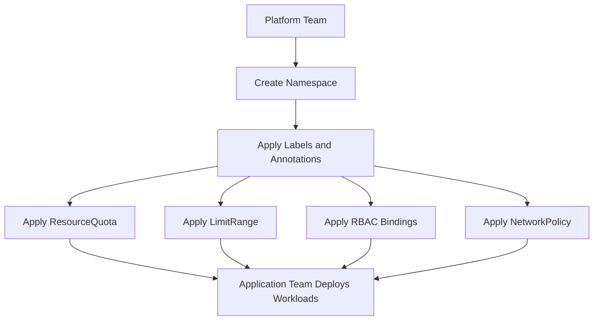

# Namespace Architecture

## Why architecture matters

Namespaces are simple to create, but they sit at the center of many platform decisions. In a real cluster, a namespace is not only a name boundary. It is the place where governance, security, automation, and workload ownership all come together.

This document explains how namespaces fit into Kubernetes architecture and how they interact with quotas, limit ranges, RBAC, labels, and network policies.

## Layered view

A useful way to understand namespaces is to think in layers.

```text
┌──────────────────────────────────────────────────────────────┐
│ Cluster Infrastructure                                      │
│ - Worker nodes                                              │
│ - Control plane APIs                                        │
│ - Networking                                                │
│ - Storage                                                   │
└──────────────────────────────────────────────────────────────┘
                           │
                           ▼
┌──────────────────────────────────────────────────────────────┐
│ Namespace Layer                                             │
│ - Logical tenancy boundary                                  │
│ - Labels and annotations                                    │
│ - Resource quotas                                           │
│ - Limit ranges                                              │
│ - RBAC bindings                                             │
│ - Network policies                                          │
└──────────────────────────────────────────────────────────────┘
                           │
                           ▼
┌──────────────────────────────────────────────────────────────┐
│ Workload Layer                                              │
│ - Pods                                                      │
│ - Deployments                                               │
│ - Services                                                  │
│ - ConfigMaps                                                │
│ - Secrets                                                   │
└──────────────────────────────────────────────────────────────┘
```

The cluster provides shared infrastructure. The namespace creates a logical operating boundary. Workloads run inside that boundary.

## Multi-namespace cluster model

The original module documentation shows a common pattern: one shared cluster with several namespaces, each containing its own governance objects.

```text
┌─────────────────────────────────────────────────────────────┐
│                    Kubernetes Cluster                       │
│                                                             │
│  ┌────────────────┐  ┌────────────────┐  ┌────────────────┐ │
│  │   Namespace    │  │   Namespace    │  │   Namespace    │ │
│  │   Production   │  │    Staging     │  │  Development   │ │
│  │                │  │                │  │                │ │
│  │ ResourceQuota  │  │ ResourceQuota  │  │ ResourceQuota  │ │
│  │ LimitRange     │  │ LimitRange     │  │ LimitRange     │ │
│  │ RBAC Bindings  │  │ RBAC Bindings  │  │ RBAC Bindings  │ │
│  │ Net Policies   │  │ Net Policies   │  │ Net Policies   │ │
│  └────────────────┘  └────────────────┘  └────────────────┘ │
└─────────────────────────────────────────────────────────────┘
```

This model is widely used because it balances cost efficiency and operational control. Teams share one cluster, but not one unmanaged space.

## Core architecture concepts

### 1. Namespace as a logical tenancy boundary

A namespace is not a physical separation like a dedicated cluster or dedicated node pool. It is a logical boundary enforced by Kubernetes APIs and related policy objects.

That boundary is used for:

- naming separation
- access control
- policy attachment
- resource governance
- automation targeting

### 2. Namespace metadata drives automation

Labels and annotations attached to a namespace often control platform behavior.

Examples:

- `environment=production`
- `team=payments`
- `managed-by=terraform`
- service mesh injection labels
- monitoring or alerting annotations

Operators and controllers read this metadata to decide what to do. This is why namespace design affects more than documentation or organization.

### 3. Governance objects live around the namespace

The namespace itself is only one Kubernetes object, but it is often surrounded by several additional resources:

- `ResourceQuota`
- `LimitRange`
- `RoleBinding`
- `ClusterRoleBinding`
- `ServiceAccount`
- `NetworkPolicy`

Together, these objects define how workloads in that namespace may behave.

## Control flow from platform team to workload team



This is the normal operational sequence in enterprise environments. Namespace creation is usually a platform-owned task, while workload deployment is team-owned.

## Shared cluster versus separate clusters

### Shared cluster with namespaces

Advantages:

- lower infrastructure cost
- simpler shared platform services
- easier standardization
- centralized governance

Trade-offs:

- requires careful RBAC and policy design
- requires quota management
- requires stronger operational discipline

### Separate cluster per team

Advantages:

- stronger isolation
- fewer shared governance conflicts
- simpler blast-radius separation

Trade-offs:

- higher cost
- more clusters to operate
- duplicated tooling and automation

In many landing zone designs, namespaces are the first and most practical tenancy unit before creating many separate clusters.

## Technical boundaries to understand

Namespaces isolate many resources, but not everything.

### Common namespaced resources

- Pods
- Deployments
- Services
- Secrets
- ConfigMaps
- Jobs
- ServiceAccounts

### Common cluster-scoped resources

- Nodes
- Namespaces
- PersistentVolumes
- ClusterRoles
- ClusterRoleBindings
- CustomResourceDefinitions

This distinction matters because namespaced isolation does not automatically control cluster-scoped objects unless additional policy is applied.

## Typical enterprise namespace patterns

### Environment-based namespaces

- `dev`
- `test`
- `staging`
- `prod`

Useful when one platform team manages the application lifecycle across environments.

### Team-based namespaces

- `payments`
- `analytics`
- `monitoring`

Useful when organizational ownership is the main dividing factor.

### Team plus environment namespaces

- `payments-dev`
- `payments-prod`
- `analytics-dev`
- `analytics-prod`

This is often the most practical pattern because it combines ownership and environment separation.

## Architecture takeaway

Namespaces are the operational center of multi-tenant Kubernetes design. They sit between shared cluster infrastructure and individual workloads, making them the key control point for governance, security, and team autonomy.