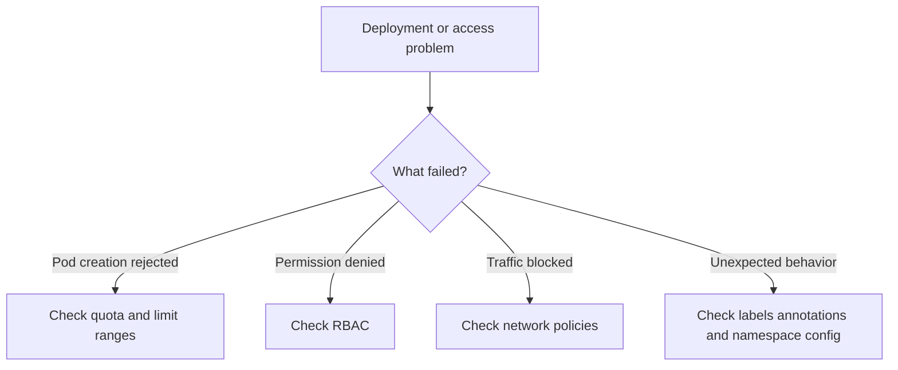

# Namespace Troubleshooting

## Overview

Namespace issues usually appear in one of four areas:

- resource quota enforcement
- limit range validation
- RBAC permission errors
- network policy blocking traffic

The original namespace documentation includes practical commands for all of these areas. This page organizes them into a simple troubleshooting workflow.

## Troubleshooting flow



## 1. Quota exceeded

### Symptom

A deployment, pod, or PVC fails to create because the namespace has reached its allowed budget.

### Useful commands

```bash
kubectl describe resourcequota -n production
kubectl top pods -n production
kubectl get pods -n production -o custom-columns=\
NAME:.metadata.name,\
CPU_REQ:.spec.containers[*].resources.requests.cpu,\
MEM_REQ:.spec.containers[*].resources.requests.memory
```

### What to look for

- current `used` versus `hard` values in the quota
- pods requesting unusually high CPU or memory
- a growing number of services, PVCs, or secrets
- recent workloads that pushed the namespace over the limit

### Common fixes

- reduce resource requests for oversized workloads
- delete unused objects
- move workloads to the correct namespace
- increase the quota if the higher usage is valid and approved

## 2. Limit range validation failures

### Symptom

A pod is rejected because its resource settings do not match the namespace rules.

Typical examples:

- CPU request below the minimum
- memory limit above the maximum
- PVC size outside allowed range

### What to check

- namespace `LimitRange` configuration
- deployment or pod resource requests and limits
- whether defaults were applied as expected

### Practical approach

Compare the workload YAML with the namespace policy:

- is CPU lower than `min`
- is memory higher than `max`
- did the container omit values that should have been defaulted

### Common fixes

- update workload resource values
- adjust the limit range if platform defaults are too strict
- align application templates with the namespace standard

## 3. RBAC permission denied

### Symptom

A user or pipeline receives an authorization error such as forbidden or cannot perform action.

### Useful commands

```bash
kubectl get rolebindings -n production
kubectl describe rolebinding admin-binding -n production
kubectl auth can-i create pods --namespace=production --as=user@company.com
```

### What to look for

- whether the expected role binding exists
- whether the user, group, or service account is included as a subject
- whether the role assigned is `view`, `edit`, or `admin`
- whether the action is namespace-scoped or cluster-scoped

### Common fixes

- add the correct subject to the binding
- use the correct role for the required action
- bind the service account in the correct namespace
- use a `ClusterRoleBinding` only if cluster-wide access is truly needed

## 4. Network policy blocking traffic

### Symptom

A service is healthy, but pods cannot reach it from another namespace or application tier.

### Useful commands

```bash
kubectl get networkpolicies -n production
kubectl describe networkpolicy allow-frontend -n production
kubectl run test-pod --image=busybox -n production -- \
  wget -O- http://backend-service.backend.svc.cluster.local:8080
```

### What to look for

- whether a default-deny policy exists
- whether the source namespace labels match the selector
- whether the correct destination port is allowed
- whether both ingress and egress rules are needed

### Common fixes

- add an explicit allow rule
- correct namespace labels used in selectors
- add missing egress permissions
- validate that pods match the expected pod selector labels

## 5. Namespace metadata issues

### Symptom

Automation, monitoring, service mesh injection, or policy selection behaves unexpectedly.

### What to check

- namespace labels
- namespace annotations
- spelling and casing of label keys
- whether automation expects a specific metadata key

### Common fixes

- correct missing or incorrect labels
- standardize metadata across environments
- document required labels for platform services

## 6. Terraform and desired-state drift

### Symptom

The cluster behavior does not match what the Terraform code appears to declare.

### What to check

- whether Terraform was actually applied
- whether manual cluster changes were made outside Terraform
- whether the namespace name in one map matches the namespace list exactly
- whether related objects failed during apply

### Common fixes

- run a Terraform plan and compare expected changes
- remove ad hoc manual changes where appropriate
- ensure namespace keys match exactly across quotas, limits, and policies

## Quick diagnostic checklist

When a namespace-related issue occurs, check in this order:

1. Is the namespace present
2. Are labels and annotations correct
3. Is quota blocking object creation
4. Is limit range blocking workload sizing
5. Is RBAC blocking the action
6. Is network policy blocking connectivity
7. Does Terraform state match the cluster

## Key takeaway

Most namespace problems are not caused by the namespace object alone. They are caused by the policy and governance resources attached to it. Troubleshooting gets easier when you check those layers one by one.