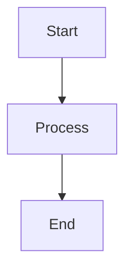

# IBM Cloud Landing Zone Documentation Website

Beautiful, interactive documentation website for IBM Cloud Landing Zone built with MkDocs Material theme.

## 🌟 Features

- **Modern Design**: Clean, professional interface with IBM blue theme
- **Interactive Elements**: Mermaid diagrams, code tabs, and animations
- **Responsive**: Mobile-friendly design that works on all devices
- **Search**: Full-text search with instant results
- **Dark Mode**: Automatic dark/light mode switching
- **Navigation**: Intuitive navigation with breadcrumbs and TOC
- **Performance**: Fast loading with instant page transitions
- **Accessibility**: WCAG compliant with keyboard navigation

## 📋 Prerequisites

- Python 3.8 or later
- pip (Python package manager)
- Git (for deployment)

## 🚀 Quick Start

### 1. Setup

Run the setup script to install all dependencies:

```bash
cd docs-website
./setup.sh
```

This will:
- Check for Python and pip
- Create a virtual environment (optional)
- Install all required packages

### 2. Development Server

Start the local development server:

```bash
./serve.sh
```

The documentation will be available at: http://127.0.0.1:8000

Changes to markdown files will automatically reload the browser.

### 3. Build Static Site

Build the static HTML site:

```bash
./build.sh
```

The built site will be in the `site/` directory.

### 4. Deploy to GitHub Pages

Deploy the documentation to GitHub Pages:

```bash
./deploy.sh
```

## 📁 Project Structure

```
docs-website/
├── mkdocs.yml                 # Main configuration file
├── requirements.txt           # Python dependencies
├── README.md                  # This file
├── setup.sh                   # Setup script
├── serve.sh                   # Development server script
├── build.sh                   # Build script
├── deploy.sh                  # Deployment script
│
├── docs/                      # Documentation content
│   ├── index.md              # Homepage
│   ├── getting-started.md    # Getting started guide
│   ├── vpc/                  # VPC documentation
│   ├── vsi/                  # VSI documentation
│   ├── cluster/              # Cluster documentation
│   ├── security/             # Security documentation
│   ├── observability/        # Observability documentation
│   ├── storage/              # Storage documentation
│   ├── database/             # Database documentation
│   ├── networking/           # Networking documentation
│   ├── iam/                  # IAM documentation
│   ├── resource-management/  # Resource management documentation
│   ├── reference/            # Reference documentation
│   ├── contributing/         # Contributing guidelines
│   │
│   ├── stylesheets/          # Custom CSS
│   │   ├── extra.css
│   │   └── custom.css
│   │
│   ├── javascripts/          # Custom JavaScript
│   │   ├── extra.js
│   │   └── mathjax.js
│   │
│   └── assets/               # Images and other assets
│       └── images/
│
├── overrides/                # Theme overrides
│   └── home.html
│
└── .github/
    └── workflows/
        └── deploy-docs.yml   # GitHub Actions workflow
```

## 🎨 Customization

### Colors

The site uses IBM's color palette. To customize colors, edit `docs/stylesheets/extra.css`:

```css
:root {
  --ibm-blue-60: #0f62fe;  /* Primary color */
  --ibm-cyan: #1192e8;     /* Accent color */
  /* ... more colors ... */
}
```

### Navigation

Edit the `nav` section in `mkdocs.yml` to customize the navigation structure.

### Theme Features

Enable/disable features in `mkdocs.yml` under `theme.features`:

```yaml
features:
  - navigation.instant      # Instant loading
  - navigation.tabs         # Top-level tabs
  - search.suggest          # Search suggestions
  # ... more features ...
```

## 📝 Writing Documentation

### Markdown Files

Create markdown files in the `docs/` directory. Use frontmatter for metadata:

```markdown
---
title: Page Title
description: Page description
---

# Page Content
```

### Admonitions

Use admonitions for notes, tips, warnings:

```markdown
!!! note "Optional Title"
    This is a note.

!!! tip
    This is a tip.

!!! warning
    This is a warning.

!!! danger
    This is a danger alert.
```

### Code Blocks

Use fenced code blocks with syntax highlighting:

````markdown
```python
def hello_world():
    print("Hello, World!")
```
````

### Mermaid Diagrams

Create diagrams with Mermaid:

````markdown

````

### Tabs

Create tabbed content:

```markdown
=== "Tab 1"
    Content for tab 1

=== "Tab 2"
    Content for tab 2
```

### Custom Styling

Use custom CSS classes defined in `extra.css`:

```markdown
<div class="feature-card">
  <h3>Feature Title</h3>
  <p>Feature description</p>
</div>
```

## 🔧 Configuration

### Site Information

Edit `mkdocs.yml` to update site information:

```yaml
site_name: Your Site Name
site_url: https://your-site.com
site_description: Your site description
```

### Plugins

Add or remove plugins in `mkdocs.yml`:

```yaml
plugins:
  - search
  - minify
  - git-revision-date-localized
  - awesome-pages
```

### Extensions

Enable markdown extensions:

```yaml
markdown_extensions:
  - admonition
  - pymdownx.superfences
  - pymdownx.tabbed
  # ... more extensions ...
```

### Vercel (Recommended)

Deploy to Vercel for instant global CDN and automatic deployments:

#### Prerequisites
- Vercel account (free tier available)
- GitHub repository connected to Vercel

#### Quick Deploy

1. **Import Project to Vercel**
   - Go to [Vercel Dashboard](https://vercel.com/dashboard)
   - Click "Add New Project"
   - Import your GitHub repository

2. **Configure Build Settings**
   - Framework Preset: `Other`
   - Build Command: `cd docs-website && pip install -r requirements.txt && mkdocs build`
   - Output Directory: `docs-website/site`
   - Install Command: `pip install --upgrade pip`

3. **Deploy**
   - Click "Deploy"
   - Your site will be live in minutes!

The `vercel.json` configuration file in the root directory handles all settings automatically.

#### Automatic Deployments
- **Production**: Pushes to `main` branch deploy to production
- **Preview**: Pull requests get preview deployments
- **Instant Rollbacks**: One-click rollback to previous versions

#### Custom Domain
1. Go to Project Settings → Domains
2. Add your custom domain
3. Configure DNS records as instructed
4. SSL certificate is automatically provisioned

See [DEPLOYMENT.md](../DEPLOYMENT.md) for detailed Vercel deployment guide.

## 🚢 Deployment

### GitHub Pages (Automated)

The site automatically deploys to GitHub Pages when you push to the `main` branch.

The workflow is defined in `.github/workflows/deploy-docs.yml`.

### GitHub Pages (Manual)

Deploy manually using the deploy script:

```bash
./deploy.sh
```

### Other Platforms

Build the static site and deploy to any static hosting:

```bash
./build.sh
# Upload the site/ directory to your hosting provider
```

## 🧪 Testing

### Local Testing

Test the site locally:

```bash
./serve.sh
```

### Build Testing

Test the build process:

```bash
./build.sh
```

### Link Checking

The GitHub Actions workflow includes link checking for pull requests.

## 📚 Additional Resources

- [MkDocs Documentation](https://www.mkdocs.org/)
- [Material for MkDocs](https://squidfunk.github.io/mkdocs-material/)
- [Markdown Guide](https://www.markdownguide.org/)
- [Mermaid Documentation](https://mermaid.js.org/)

## 🤝 Contributing

1. Fork the repository
2. Create a feature branch
3. Make your changes
4. Test locally with `./serve.sh`
5. Submit a pull request

See [CONTRIBUTING.md](contributing/) for detailed guidelines.

## 📄 License

This documentation is licensed under the Apache License 2.0.

## 🆘 Support

- **Issues**: [GitHub Issues](https://github.com/ibm-cloud/landing-zone/issues)
- **Discussions**: [GitHub Discussions](https://github.com/ibm-cloud/landing-zone/discussions)
- **IBM Cloud Support**: [Contact Support](https://cloud.ibm.com/unifiedsupport/supportcenter)

## 🎯 Roadmap

- [ ] Add more interactive examples
- [ ] Create video tutorials
- [ ] Add API documentation
- [ ] Implement versioning
- [ ] Add multi-language support

## 📊 Statistics

- **Modules**: 11 infrastructure modules
- **Pages**: 50+ documentation pages
- **Code Examples**: 100+ code snippets
- **Diagrams**: 20+ architecture diagrams

---

**Built with ❤️ using MkDocs Material**