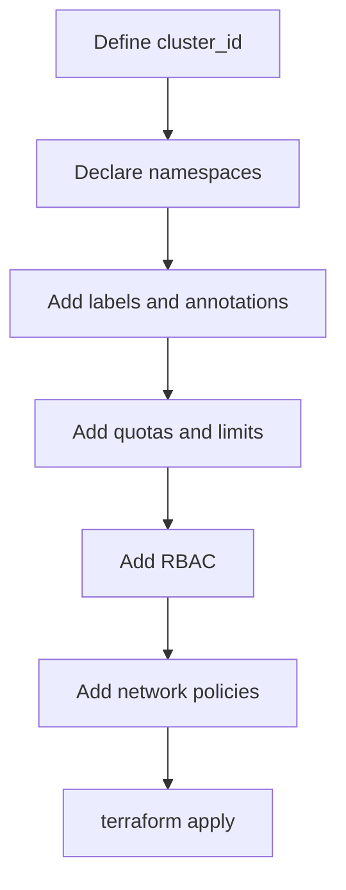

# Terraform Module Usage

## Overview

The `terraform-ibm-namespace` module is used to create and govern namespaces in IBM Cloud Kubernetes Service (IKS) and Red Hat OpenShift on IBM Cloud (ROKS). It allows platform teams to define namespace configuration once in Terraform and apply it consistently across environments.

**Module Repository:** [terraform-ibm-modules/terraform-ibm-namespace](https://github.com/terraform-ibm-modules/terraform-ibm-namespace)

## What the module provides

The source documentation highlights these capabilities:

- namespace lifecycle management
- labels and annotations
- resource quotas
- limit ranges
- role bindings
- cluster role bindings
- service accounts
- network policy integration

## Key inputs

### Required inputs

| Input | Type | Description |
|---|---|---|
| `cluster_id` | string | ID of the IKS or ROKS cluster |
| `namespaces` | list(object) | List of namespaces to create |

### Optional inputs

| Input | Type | Default | Description |
|---|---|---|---|
| `resource_quotas` | map(object) | `{}` | Quotas per namespace |
| `limit_ranges` | map(object) | `{}` | Limit ranges per namespace |
| `role_bindings` | list(object) | `[]` | Namespace-scoped RBAC bindings |
| `cluster_role_bindings` | list(object) | `[]` | Cluster-wide RBAC bindings |
| `service_accounts` | list(object) | `[]` | Service account definitions |
| `network_policies` | map(object) | `{}` | Network policies per namespace |

## Basic example

```hcl
module "namespaces" {
  source  = "terraform-ibm-modules/namespace/ibm"
  version = "~> 1.0"

  cluster_id = module.openshift_cluster.cluster_id

  namespaces = [
    {
      name = "production"
      labels = {
        environment = "production"
        team        = "platform"
        cost-center = "engineering"
      }
      annotations = {
        owner       = "platform-team@company.com"
        description = "Production workloads"
      }
    },
    {
      name = "staging"
      labels = {
        environment = "staging"
        team        = "platform"
      }
      annotations = {
        owner = "platform-team@company.com"
      }
    },
    {
      name = "development"
      labels = {
        environment = "development"
        team        = "engineering"
      }
    }
  ]
}
```

## Example: namespace with quotas

```hcl
module "namespaces_with_quotas" {
  source  = "terraform-ibm-modules/namespace/ibm"
  version = "~> 1.0"

  cluster_id = module.openshift_cluster.cluster_id

  namespaces = [
    {
      name = "production"
      labels = {
        environment = "production"
      }
    }
  ]

  resource_quotas = {
    production = {
      hard = {
        "requests.cpu"            = "100"
        "limits.cpu"              = "200"
        "requests.memory"         = "200Gi"
        "limits.memory"           = "400Gi"
        "pods"                    = "100"
        "persistentvolumeclaims"  = "50"
        "requests.storage"        = "1Ti"
        "services"                = "50"
        "services.loadbalancers"  = "5"
        "services.nodeports"      = "10"
        "configmaps"              = "100"
        "secrets"                 = "100"
      }
    }
  }
}
```

## Example: namespace with limit ranges

```hcl
module "namespaces_with_limits" {
  source  = "terraform-ibm-modules/namespace/ibm"
  version = "~> 1.0"

  cluster_id = module.openshift_cluster.cluster_id

  namespaces = [
    {
      name = "production"
      labels = {
        environment = "production"
      }
    }
  ]

  limit_ranges = {
    production = {
      limits = [
        {
          type = "Container"
          max = {
            cpu    = "4"
            memory = "8Gi"
          }
          min = {
            cpu    = "100m"
            memory = "128Mi"
          }
          default = {
            cpu    = "500m"
            memory = "512Mi"
          }
          default_request = {
            cpu    = "250m"
            memory = "256Mi"
          }
        },
        {
          type = "Pod"
          max = {
            cpu    = "8"
            memory = "16Gi"
          }
        }
      ]
    }
  }
}
```

## Example: namespace with RBAC

```hcl
module "namespaces_with_rbac" {
  source  = "terraform-ibm-modules/namespace/ibm"
  version = "~> 1.0"

  cluster_id = module.openshift_cluster.cluster_id

  namespaces = [
    {
      name = "production"
      labels = {
        environment = "production"
      }
    },
    {
      name = "staging"
      labels = {
        environment = "staging"
      }
    }
  ]

  role_bindings = [
    {
      namespace = "production"
      role_name = "admin"
      subjects = [
        {
          kind      = "Group"
          name      = "production-admins"
          api_group = "rbac.authorization.k8s.io"
        },
        {
          kind      = "User"
          name      = "john.doe@company.com"
          api_group = "rbac.authorization.k8s.io"
        }
      ]
    },
    {
      namespace = "production"
      role_name = "view"
      subjects = [
        {
          kind      = "Group"
          name      = "production-viewers"
          api_group = "rbac.authorization.k8s.io"
        }
      ]
    }
  ]

  service_accounts = [
    {
      namespace = "production"
      name      = "app-deployer"
      annotations = {
        "description" = "Service account for CI/CD deployments"
      }
    }
  ]
}
```

## Example: complete multi-tenant pattern

```hcl
module "multi_tenant_namespaces" {
  source  = "terraform-ibm-modules/namespace/ibm"
  version = "~> 1.0"

  cluster_id = module.openshift_cluster.cluster_id

  namespaces = [
    {
      name = "team-alpha-prod"
      labels = {
        team        = "alpha"
        environment = "production"
        cost-center = "engineering"
      }
      annotations = {
        owner       = "team-alpha@company.com"
        description = "Team Alpha production workloads"
      }
    },
    {
      name = "team-alpha-dev"
      labels = {
        team        = "alpha"
        environment = "development"
      }
      annotations = {
        owner = "team-alpha@company.com"
      }
    },
    {
      name = "team-beta-prod"
      labels = {
        team        = "beta"
        environment = "production"
        cost-center = "product"
      }
      annotations = {
        owner = "team-beta@company.com"
      }
    }
  ]

  resource_quotas = {
    team-alpha-prod = {
      hard = {
        "requests.cpu"    = "50"
        "requests.memory" = "100Gi"
        "pods"            = "50"
        "services"        = "25"
      }
    }
    team-alpha-dev = {
      hard = {
        "requests.cpu"    = "20"
        "requests.memory" = "40Gi"
        "pods"            = "30"
      }
    }
    team-beta-prod = {
      hard = {
        "requests.cpu"    = "80"
        "requests.memory" = "160Gi"
        "pods"            = "80"
        "services"        = "40"
      }
    }
  }
}
```

## Practical guidance for beginners

- Start with just `namespaces`
- Add `resource_quotas` when multiple teams share the cluster
- Add `limit_ranges` to enforce sane defaults
- Add `role_bindings` before handing access to application teams
- Add `network_policies` once traffic boundaries are defined
- Use labels consistently because later automation depends on them

## Common implementation sequence



## Key takeaway

The Terraform module gives platform engineers a repeatable way to create namespaces and their supporting governance objects. Instead of manually creating Kubernetes resources one by one, Terraform keeps the entire namespace design in version-controlled code.