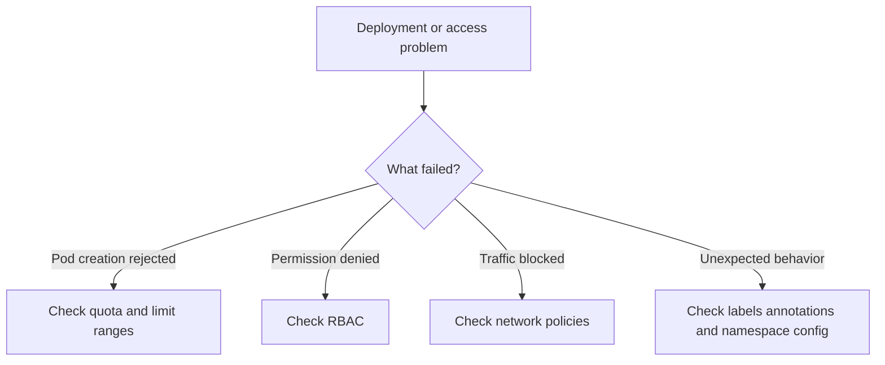

# Namespace Troubleshooting

## Overview

Namespace issues usually appear in one of four areas:

- resource quota enforcement
- limit range validation
- RBAC permission errors
- network policy blocking traffic

## Troubleshooting flow



## 1. Quota exceeded

### Useful commands

```bash
kubectl describe resourcequota -n production
kubectl top pods -n production
kubectl get pods -n production -o custom-columns=\
NAME:.metadata.name,\
CPU_REQ:.spec.containers[*].resources.requests.cpu,\
MEM_REQ:.spec.containers[*].resources.requests.memory
```

### Common fixes

- reduce resource requests for oversized workloads
- delete unused objects
- move workloads to the correct namespace
- increase the quota if the higher usage is valid and approved

## 2. Limit range validation failures

### Common fixes

- update workload resource values
- adjust the limit range if platform defaults are too strict
- align application templates with the namespace standard

## 3. RBAC permission denied

### Useful commands

```bash
kubectl get rolebindings -n production
kubectl describe rolebinding admin-binding -n production
kubectl auth can-i create pods --namespace=production --as=user@company.com
```

### Common fixes

- add the correct subject to the binding
- use the correct role for the required action
- bind the service account in the correct namespace
- use a `ClusterRoleBinding` only if cluster-wide access is truly needed

## 4. Network policy blocking traffic

### Useful commands

```bash
kubectl get networkpolicies -n production
kubectl describe networkpolicy allow-frontend -n production
kubectl run test-pod --image=busybox -n production -- \
  wget -O- http://backend-service.backend.svc.cluster.local:8080
```

### Common fixes

- add an explicit allow rule
- correct namespace labels used in selectors
- add missing egress permissions
- validate that pods match the expected pod selector labels

## Quick diagnostic checklist

1. Is the namespace present
2. Are labels and annotations correct
3. Is quota blocking object creation
4. Is limit range blocking workload sizing
5. Is RBAC blocking the action
6. Is network policy blocking connectivity
7. Does Terraform state match the cluster

## Key takeaway

Most namespace problems are caused by the policy and governance resources attached to the namespace. Troubleshooting gets easier when you check those layers one by one.