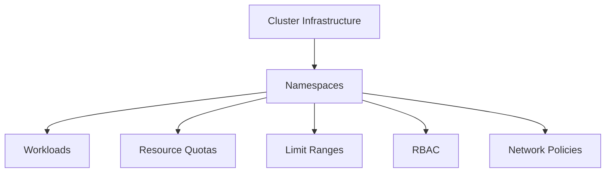

# Namespace Documentation

Namespaces are one of the most important building blocks in Kubernetes and OpenShift. This section breaks namespace management into focused documents so you can learn the concept first and then understand how Terraform provisions and governs namespaces in an IBM Cloud Landing Zone.

## What you will learn

- What namespaces are and why Kubernetes needs them
- How namespaces act as logical tenancy boundaries
- How Terraform module inputs become Kubernetes resources
- How quotas, limits, RBAC, and network policies work together
- What design patterns and troubleshooting steps are common in real environments

## Reading guide

If you are new to the topic, read these pages in order:

1. [Namespace Fundamentals](01-namespace-fundamentals.md)
2. [Terraform Module Usage](03-terraform-module-usage.md)
3. [Resource Quotas and Limits](04-resource-quotas-limits.md)
4. [RBAC and Security](05-rbac-security.md)
5. [Network Policies](06-network-policies.md)
6. [Terraform Mapping](07-terraform-mapping.md)
7. [Best Practices](08-best-practices.md)
8. [Troubleshooting](09-troubleshooting.md)

## At a glance

A namespace is not a separate cluster. It is a controlled workspace inside a shared cluster. That simple idea is what makes multi-team platform engineering practical.
