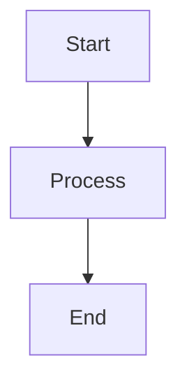

# Contributing to IBM Cloud Landing Zone Documentation

Thank you for your interest in contributing to the IBM Cloud Landing Zone documentation! This guide will help you get started.

## 🤝 How to Contribute

There are many ways to contribute:

- **Fix typos or errors**: Submit corrections for documentation mistakes
- **Improve clarity**: Enhance explanations and examples
- **Add examples**: Contribute code examples and use cases
- **Create diagrams**: Add architecture diagrams and visualizations
- **Write tutorials**: Create step-by-step guides
- **Translate**: Help translate documentation to other languages

## 🚀 Getting Started

### 1. Fork the Repository

Click the "Fork" button on GitHub to create your own copy of the repository.

### 2. Clone Your Fork

```bash
git clone https://github.com/YOUR-USERNAME/landing-zone.git
cd landing-zone/docs-website
```

### 3. Set Up Development Environment

```bash
./setup.sh
```

### 4. Create a Branch

```bash
git checkout -b feature/your-feature-name
```

### 5. Make Your Changes

Edit the markdown files in the `docs/` directory.

### 6. Test Locally

```bash
./serve.sh
```

Visit http://127.0.0.1:8000 to preview your changes.

### 7. Commit Your Changes

```bash
git add .
git commit -m "Description of your changes"
```

### 8. Push to Your Fork

```bash
git push origin feature/your-feature-name
```

### 9. Create a Pull Request

Go to GitHub and create a pull request from your fork to the main repository.

## 📝 Writing Guidelines

### Style Guide

- **Use clear, concise language**: Avoid jargon when possible
- **Be consistent**: Follow existing patterns and terminology
- **Use active voice**: "Deploy the VPC" instead of "The VPC should be deployed"
- **Include examples**: Provide code examples and use cases
- **Add diagrams**: Use Mermaid for architecture diagrams

### Markdown Formatting

#### Headings

```markdown
# H1 - Page Title
## H2 - Major Section
### H3 - Subsection
#### H4 - Minor Section
```

#### Code Blocks

Use fenced code blocks with language specification:

````markdown
```bash
ibmcloud login
```

```python
def example():
    return "Hello"
```
````

#### Admonitions

```markdown
!!! note
    Important information

!!! tip
    Helpful suggestion

!!! warning
    Caution required

!!! danger
    Critical warning
```

#### Links

```markdown
[Link Text](relative/path/to/page.md)
[External Link](https://example.com)
```

#### Images

```markdown

```

### Documentation Structure

- **Overview**: Brief introduction to the topic
- **Prerequisites**: What's needed before starting
- **Step-by-Step Instructions**: Clear, numbered steps
- **Examples**: Real-world use cases
- **Best Practices**: Recommendations and tips
- **Troubleshooting**: Common issues and solutions
- **References**: Links to related documentation

## 🎨 Adding Diagrams

Use Mermaid for architecture diagrams:

````markdown

````

## 🧪 Testing

Before submitting a pull request:

1. **Test locally**: Run `./serve.sh` and verify your changes
2. **Check links**: Ensure all links work correctly
3. **Verify formatting**: Check that markdown renders properly
4. **Test on mobile**: Verify responsive design
5. **Run build**: Execute `./build.sh` to check for errors

## 📋 Pull Request Checklist

- [ ] Changes are tested locally
- [ ] Documentation follows style guide
- [ ] All links are working
- [ ] Code examples are tested
- [ ] Commit messages are clear
- [ ] Branch is up to date with main

## 🔍 Review Process

1. **Automated Checks**: GitHub Actions will run automated tests
2. **Peer Review**: Maintainers will review your changes
3. **Feedback**: Address any requested changes
4. **Approval**: Once approved, your PR will be merged

## 💡 Tips for Success

- **Start small**: Begin with minor improvements
- **Ask questions**: Use GitHub Discussions for questions
- **Be patient**: Reviews may take time
- **Stay engaged**: Respond to feedback promptly
- **Learn from others**: Review existing PRs

## 📞 Getting Help

- **GitHub Issues**: Report bugs or request features
- **GitHub Discussions**: Ask questions and share ideas
- **Slack**: Join our community Slack channel
- **Email**: Contact the maintainers

## 🏆 Recognition

Contributors will be:

- Listed in the contributors section
- Mentioned in release notes
- Invited to join the contributors team

## 📄 License

By contributing, you agree that your contributions will be licensed under the Apache License 2.0.

## 🙏 Thank You

Your contributions help make IBM Cloud Landing Zone better for everyone!

---

**Questions?** Open an issue or start a discussion on GitHub.