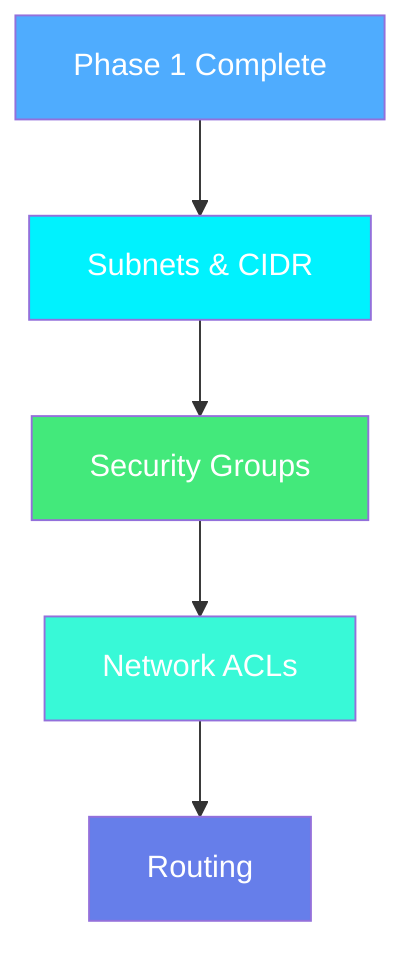
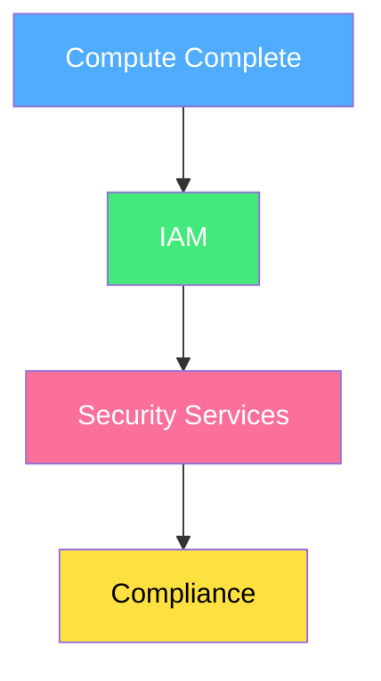
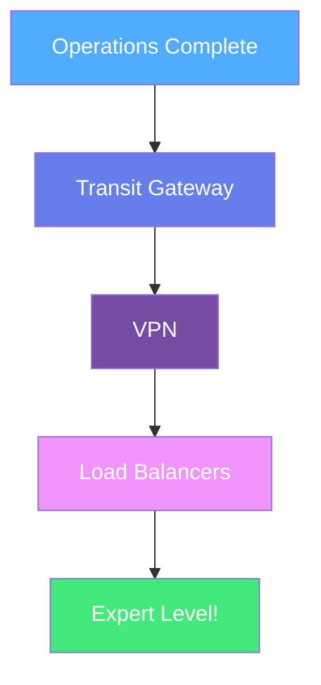

# 🗺️ Learning Path & Roadmap

## 🎯 Your Journey Through IBM Cloud Landing Zone

Follow this sequential path to master IBM Cloud infrastructure!

---

### 📍 Phase 1: Foundation (Start Here!)
**Estimated Time: 2-3 hours**

1. **🚀 [Getting Started](getting-started.md)**
   - What is Landing Zone?
   - Core concepts
   - Prerequisites

2. **🏗️ [VPC Foundation](vpc/vpc-foundation.md)**
   - Understanding VPC basics
   - Network isolation
   - Regional architecture

3. **🎨 [VPC Service Internals](vpc/vpc-service-internals.md)**
   - Design patterns
   - Best practices
   - Common scenarios

---

### 📍 Phase 2: Networking Deep Dive
**Estimated Time: 4-5 hours**

4. **🌐 [CIDR Planning](vpc/cidr-planning-ipam.md)**
5. **🔒 [Security Groups](vpc/security-group-service-internals.md)**
6. **🛡️ [Network ACLs](vpc/network-acl-architecture.md)**
7. **🔀 [Route Tables](vpc/route-table-service.md)**

---

### 📍 Phase 3: Compute & Applications
**Estimated Time: 3-4 hours**

8. **💻 [VSI Infrastructure](vsi/index.md)**
9. **☸️ [Kubernetes Clusters](cluster/index.md)**
10. **🔴 [OpenShift](cluster/index.md)**

---

### 📍 Phase 4: Security & Compliance
**Estimated Time: 2-3 hours**

11. **🔐 [IAM & Access](iam/index.md)**
12. **🛡️ [Security Infrastructure](security/index.md)**

---

### 📍 Phase 5: Operations & Monitoring
**Estimated Time: 2-3 hours**

13. **📊 [Observability](observability/index.md)**
14. **💾 [Storage Solutions](storage/index.md)**
15. **🗄️ [Database Services](database/index.md)**

---

### 📍 Phase 6: Advanced Topics
**Estimated Time: 3-4 hours**

16. **🌉 [Transit Gateway](vpc/transit-gateway-integration.md)**
17. **🔒 [VPN Architecture](vpc/vpn-architecture.md)**
18. **⚖️ [Load Balancers](vpc/load-balancer-architecture.md)**

---

## 🎓 Completion Checklist

Track your progress:

- [ ] ✅ Completed Phase 1: Foundation
- [ ] ✅ Completed Phase 2: Networking
- [ ] ✅ Completed Phase 3: Compute
- [ ] ✅ Completed Phase 4: Security
- [ ] ✅ Completed Phase 5: Operations
- [ ] ✅ Completed Phase 6: Advanced Topics

---

## 🎯 Quick Navigation

-   :material-rocket-launch:{ .lg .middle } **Just Starting?**

    ---

    Begin with [Getting Started](getting-started.md)

-   :material-network:{ .lg .middle } **Know the Basics?**

    ---

    Jump to [VPC Deep Dive](vpc/index.md)

-   :material-kubernetes:{ .lg .middle } **Ready for Compute?**

    ---

    Explore [Cluster Infrastructure](cluster/index.md)

-   :material-shield-check:{ .lg .middle } **Security Focus?**

    ---

    Start with [Security Infrastructure](security/index.md)

---

## 💡 Learning Tips

!!! tip "Pro Tips for Success"
    - 📚 Follow the phases in order for best understanding
    - 🔬 Try hands-on labs after each section
    - 📝 Take notes and create your own diagrams
    - 🤝 Join the community discussions
    - ⏸️ Take breaks - learning is a marathon, not a sprint!

!!! info "Estimated Total Time"
    Complete mastery: **16-22 hours** of focused learning