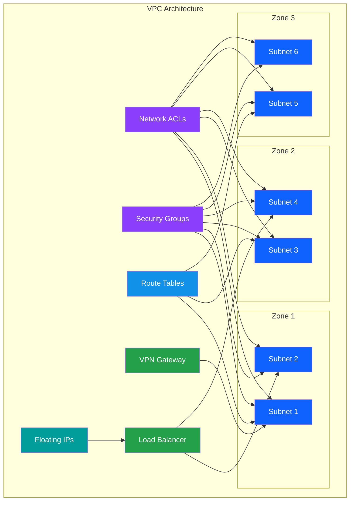

# VPC Infrastructure

## Overview

IBM Cloud Virtual Private Cloud (VPC) provides isolated, secure virtual networks for your cloud resources. This comprehensive guide covers all aspects of VPC infrastructure, from foundational concepts to advanced networking features.

## 📚 Documentation Structure

  

    

      
🏗️

      <h3 class="module-card-title">Foundation</h3>
    

    

      Core VPC concepts, architecture patterns, and foundational setup.
    

    <a href="vpc-foundation/" class="module-card-link">VPC Foundation →</a>
  

  

    

      
⚙️

      <h3 class="module-card-title">Service Internals</h3>
    

    

      Deep dive into VPC service architecture and internal mechanisms.
    

    <a href="vpc-service-internals/" class="module-card-link">Service Internals →</a>
  

  

    

      
🌍

      <h3 class="module-card-title">Zones & Datacenters</h3>
    

    

      Multi-zone architecture and datacenter distribution strategies.
    

    <a href="zones-datacenter-architecture/" class="module-card-link">Zones Architecture →</a>
  

  

    

      
📊

      <h3 class="module-card-title">CIDR Planning</h3>
    

    

      IP address management and CIDR block planning strategies.
    

    <a href="cidr-planning-ipam/" class="module-card-link">CIDR Planning →</a>
  

  

    

      
🔗

      <h3 class="module-card-title">Subnets</h3>
    

    

      Subnet design, service internals, and best practices.
    

    <a href="subnet-service-internals/" class="module-card-link">Subnet Service →</a>
  

  

    

      
🛡️

      <h3 class="module-card-title">Network ACLs</h3>
    

    

      Network Access Control Lists architecture and configuration.
    

    <a href="network-acl-architecture/" class="module-card-link">ACL Architecture →</a>
  

  

    

      
🔒

      <h3 class="module-card-title">Security Groups</h3>
    

    

      Security group configuration and service internals.
    

    <a href="security-group-service-internals/" class="module-card-link">Security Groups →</a>
  

  

    

      
🗺️

      <h3 class="module-card-title">Route Tables</h3>
    

    

      Custom routing and route table service configuration.
    

    <a href="route-table-service/" class="module-card-link">Route Tables →</a>
  

  

    

      
🔐

      <h3 class="module-card-title">VPN</h3>
    

    

      VPN gateway architecture and secure connectivity.
    

    <a href="vpn-architecture/" class="module-card-link">VPN Architecture →</a>
  

  

    

      
🌐

      <h3 class="module-card-title">Transit Gateway</h3>
    

    

      Multi-VPC connectivity and Transit Gateway integration.
    

    <a href="transit-gateway-integration/" class="module-card-link">Transit Gateway →</a>
  

  

    

      
🌊

      <h3 class="module-card-title">Floating IPs</h3>
    

    

      Public IP addressing and floating IP management.
    

    <a href="floating-ip-architecture/" class="module-card-link">Floating IPs →</a>
  

  

    

      
⚖️

      <h3 class="module-card-title">Load Balancers</h3>
    

    

      Application and network load balancer architecture.
    

    <a href="load-balancer-architecture/" class="module-card-link">Load Balancers →</a>
  

  

    

      
📈

      <h3 class="module-card-title">Flow Logs</h3>
    

    

      Network traffic monitoring and flow log analysis.
    

    <a href="flow-logs-observability/" class="module-card-link">Flow Logs →</a>
  

  

    

      
🔄

      <h3 class="module-card-title">Hub-Spoke DNS</h3>
    

    

      DNS architecture for hub-and-spoke network topologies.
    

    <a href="hub-spoke-dns-architecture/" class="module-card-link">Hub-Spoke DNS →</a>
  

  

    

      
🔧

      <h3 class="module-card-title">Terraform Mapping</h3>
    

    

      Infrastructure as Code with Terraform configuration.
    

    <a href="terraform-mapping/" class="module-card-link">Terraform Mapping →</a>
  

  

    

      
📤

      <h3 class="module-card-title">Outputs</h3>
    

    

      VPC outputs for downstream service consumption.
    

    <a href="outputs-downstream-consumption/" class="module-card-link">Outputs →</a>
  

## 🚀 Quick Start

Follow this recommended learning path:

1. **[VPC Foundation](vpc-foundation/)** - Start here to understand core concepts
2. **[CIDR Planning](cidr-planning-ipam/)** - Plan your IP address space
3. **[Zones & Datacenters](zones-datacenter-architecture/)** - Design for high availability
4. **[Subnets](subnet-service-internals/)** - Configure network segments
5. **[Security](network-acl-architecture/)** - Implement security controls

## 🏗️ Architecture Patterns

## 💡 Key Concepts

!!! info "VPC Isolation"
    Each VPC is completely isolated from other VPCs, providing network-level security and resource separation.

!!! tip "Multi-Zone Deployment"
    Deploy resources across multiple availability zones for high availability and disaster recovery.

!!! warning "CIDR Planning"
    Plan your CIDR blocks carefully - they cannot be changed after VPC creation.

!!! success "Security Layers"
    Use both Network ACLs (subnet-level) and Security Groups (instance-level) for defense in depth.

## 📖 Additional Resources

- [IBM Cloud VPC Documentation](https://cloud.ibm.com/docs/vpc)
- [VPC API Reference](https://cloud.ibm.com/apidocs/vpc)
- [Terraform IBM Provider](https://registry.terraform.io/providers/IBM-Cloud/ibm/latest/docs)

## 🎯 Common Use Cases

=== "Web Application"
    Deploy a multi-tier web application with:
    
    - Public subnets for load balancers
    - Private subnets for application servers
    - Isolated subnets for databases
    - VPN for administrative access

=== "Hybrid Cloud"
    Connect on-premises infrastructure:
    
    - VPN Gateway for site-to-site connectivity
    - Transit Gateway for multi-VPC routing
    - Direct Link for dedicated connectivity
    - Custom route tables for traffic control

=== "Microservices"
    Container-based architecture:
    
    - Kubernetes/OpenShift clusters (see [Cluster Infrastructure](../cluster/README.md))
    - Service mesh networking
    - Internal load balancing
    - Network policies for pod security
    
    For detailed cluster networking integration, see [VPC Networking Integration](../cluster/base-ocp-vpc/06-vpc-networking-integration.md).

=== "Data Processing"
    Big data and analytics:
    
    - High-bandwidth subnets
    - Storage-optimized instances
    - Private endpoints for Cloud Object Storage
    - Flow logs for traffic analysis