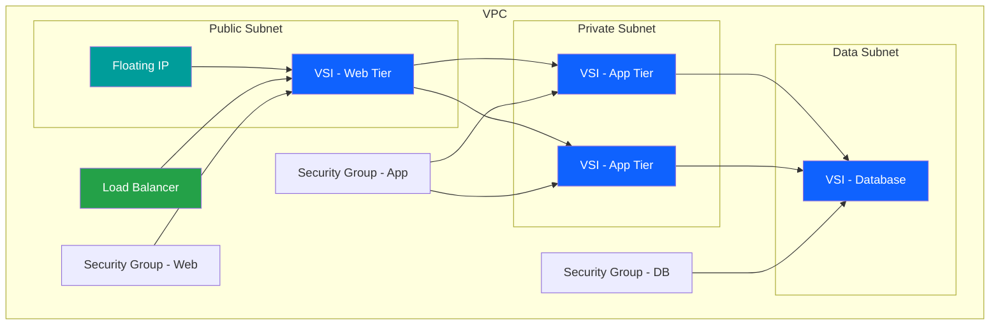

# VSI Infrastructure

## Overview

Virtual Server Instances (VSI) provide flexible, scalable compute resources in IBM Cloud VPC. This guide covers VSI deployment, configuration, and management for various workload requirements.

## 📚 Documentation

  

    

      
📖

      <h3 class="module-card-title">Complete Guide</h3>
    

    

      Comprehensive guide covering all aspects of VSI infrastructure deployment and management.
    

    <a href="vsi-infrastructure-complete-guide/" class="module-card-link">Complete Guide →</a>
  

  

    

      
🚀

      <h3 class="module-card-title">Quick Start</h3>
    

    

      Get started quickly with VSI deployment using pre-configured templates and best practices.
    

    <a href="README/" class="module-card-link">Quick Start →</a>
  

## 🏗️ VSI Architecture

## 💡 Key Features

- **Flexible Profiles**: Choose from balanced, compute, memory, or storage-optimized profiles
- **Custom Images**: Use stock images or create custom images
- **Auto Scaling**: Scale instances based on demand
- **High Availability**: Deploy across multiple zones
- **Security**: Integrated with VPC security features

## 🎯 Common Use Cases

=== "Web Servers"
    Deploy scalable web server infrastructure with load balancing and auto-scaling.

=== "Application Servers"
    Run business applications with appropriate compute and memory resources.

=== "Database Servers"
    Host databases with storage-optimized profiles and backup strategies.

=== "Development/Test"
    Create isolated environments for development and testing workloads.