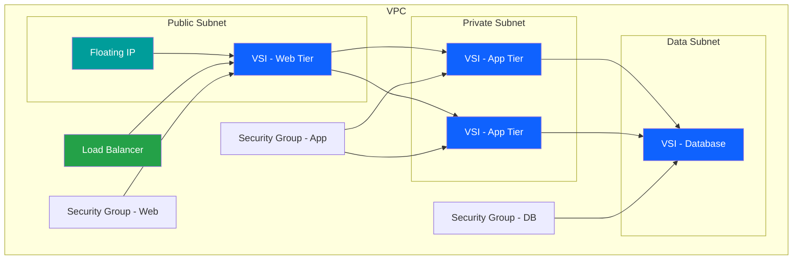

# VSI Infrastructure

## Overview

Virtual Server Instances (VSI) provide flexible, scalable compute resources in IBM Cloud VPC. This guide covers VSI deployment, configuration, and management for various workload requirements.

!!! info "Prerequisites"
    VSI deployment requires a configured VPC foundation. See [VPC Infrastructure](../vpc/README.md) for complete networking setup including [VPC Foundation](../vpc/vpc-foundation.md), [Subnets](../vpc/subnet-service-internals.md), and [Security Groups](../vpc/security-group-service-internals.md).

## 📚 Documentation

The VSI infrastructure documentation is organized into layered chapters covering the complete provisioning flow:

- **[Provisioning Overview](vsi-provisioning-overview.md)** - Start here for architecture overview
- **[Layer 1: Resource Scoping](vsi-resource-scoping.md)** - Resource groups, tags, and IAM
- **[Layer 2: Network Foundation](vsi-network-foundation.md)** - VPC, subnets, and network setup
- **[Layer 3: Compute Instantiation](vsi-compute-instantiation.md)** - VSI instances and profiles
- **[Layer 4: Storage Configuration](vsi-storage-configuration.md)** - Boot volumes and block storage
- **[Layer 5: Instance Networking](vsi-instance-networking.md)** - Network interfaces and IPs
- **[Layer 6: Security Groups](vsi-security-groups.md)** - Security group configuration
- **[Layer 7: Secondary Interfaces](vsi-secondary-interfaces.md)** - Multi-homed networking
- **[Layer 8: Load Balancer](vsi-load-balancer.md)** - Load balancer integration
- **[Layer 9: Observability](vsi-observability.md)** - Monitoring and logging
- **[Layer 10: Lifecycle & Recovery](vsi-lifecycle-recovery.md)** - Lifecycle management
- **[Architecture Summary](vsi-architecture-summary.md)** - Complete architecture overview

For quick reference, see the **[README](README.md)** for common use cases and examples.

## 🏗️ VSI Architecture

## 💡 Key Features

- **Flexible Profiles**: Choose from balanced, compute, memory, or storage-optimized profiles
- **Custom Images**: Use stock images or create custom images
- **Auto Scaling**: Scale instances based on demand
- **High Availability**: Deploy across multiple zones
- **Security**: Integrated with VPC security features

## 🎯 Common Use Cases

=== "Web Servers"
    Deploy scalable web server infrastructure with load balancing and auto-scaling.

=== "Application Servers"
    Run business applications with appropriate compute and memory resources.

=== "Database Servers"
    Host databases with storage-optimized profiles and backup strategies.

=== "Development/Test"
    Create isolated environments for development and testing workloads.